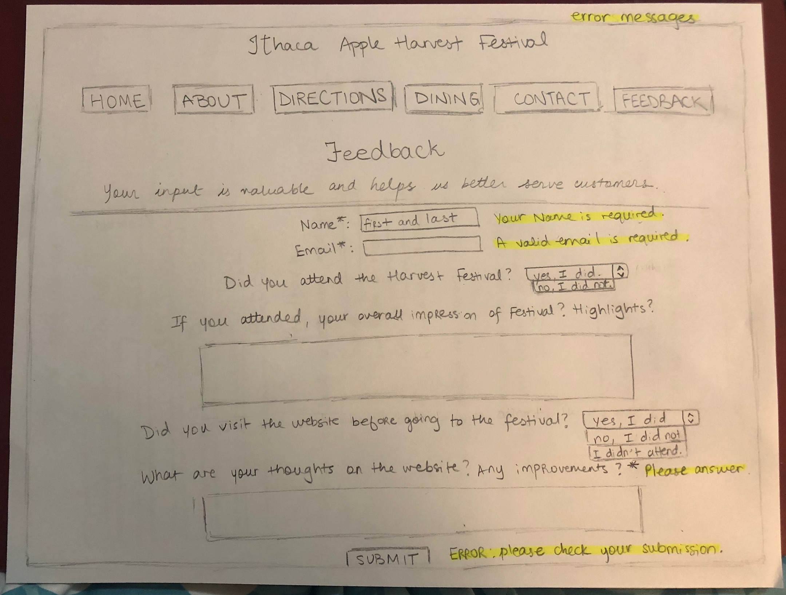
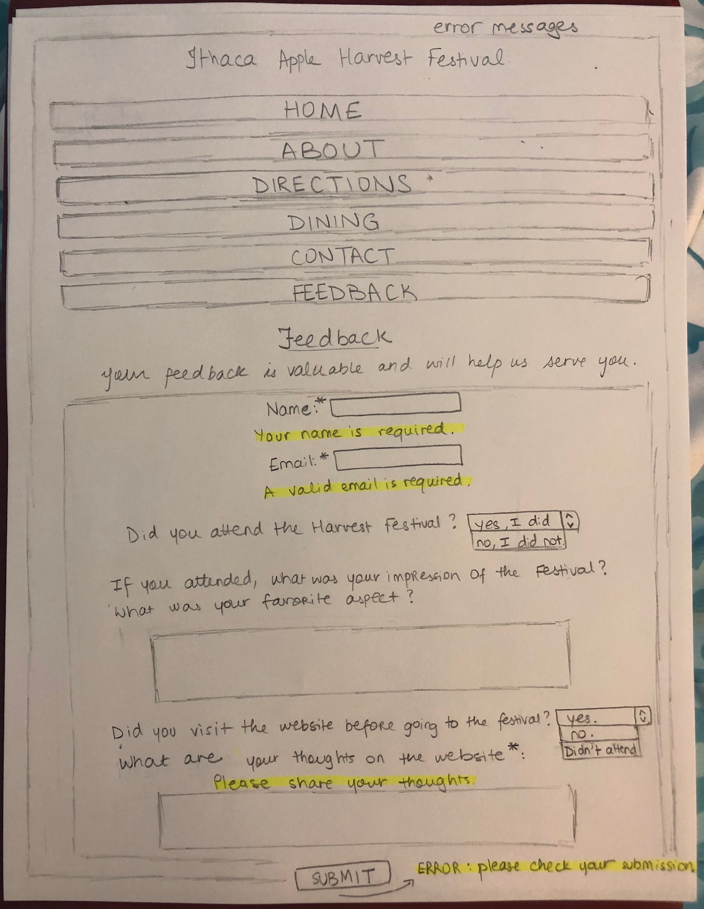
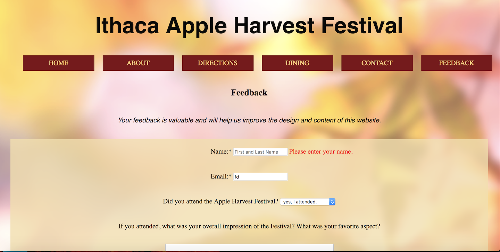
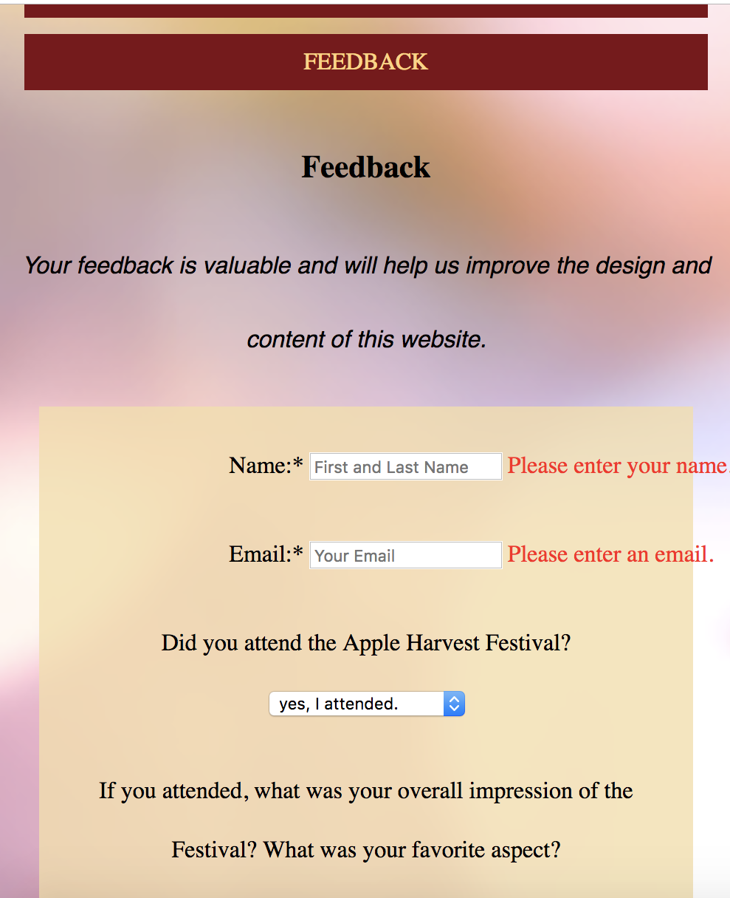
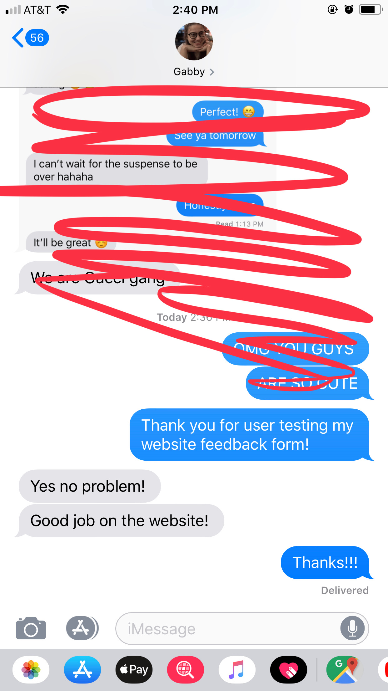
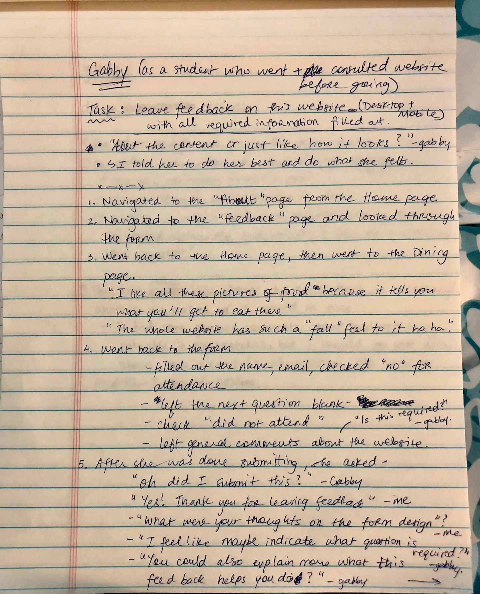
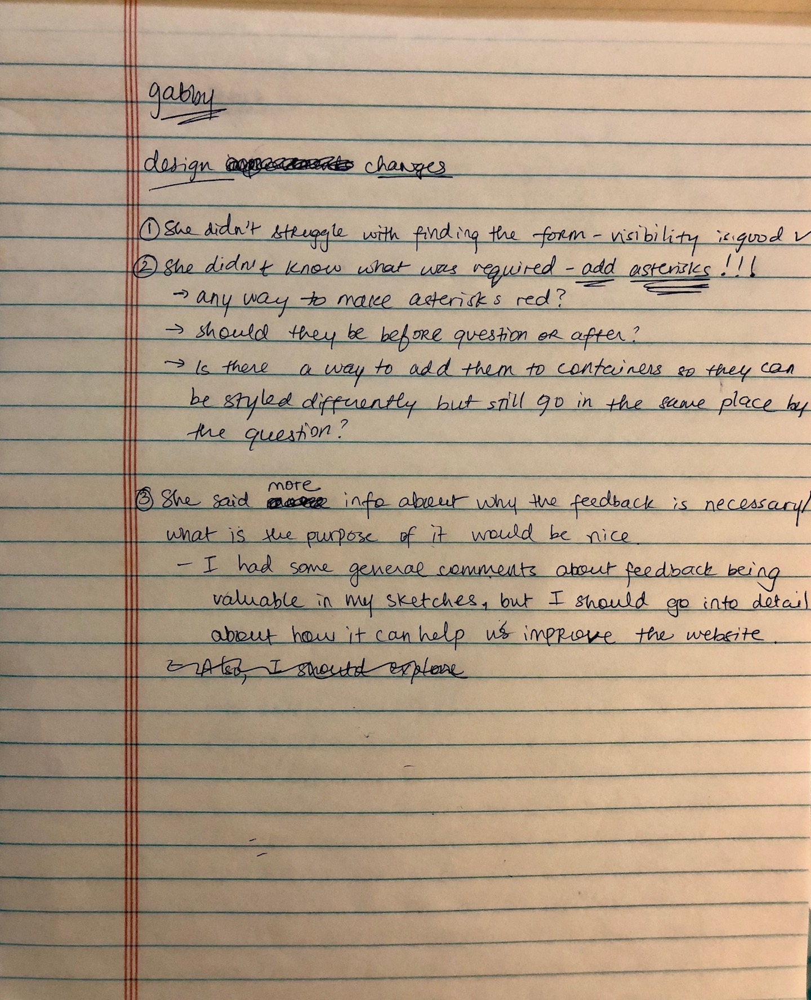
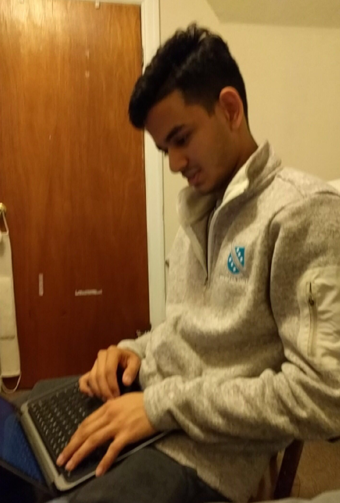
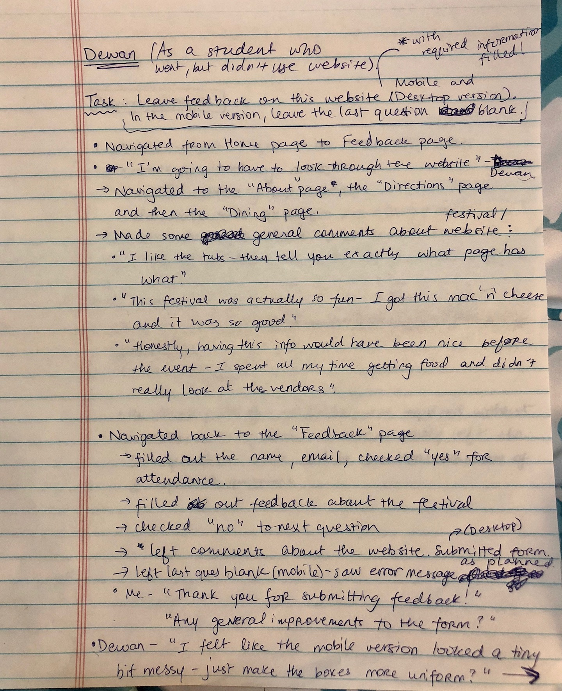
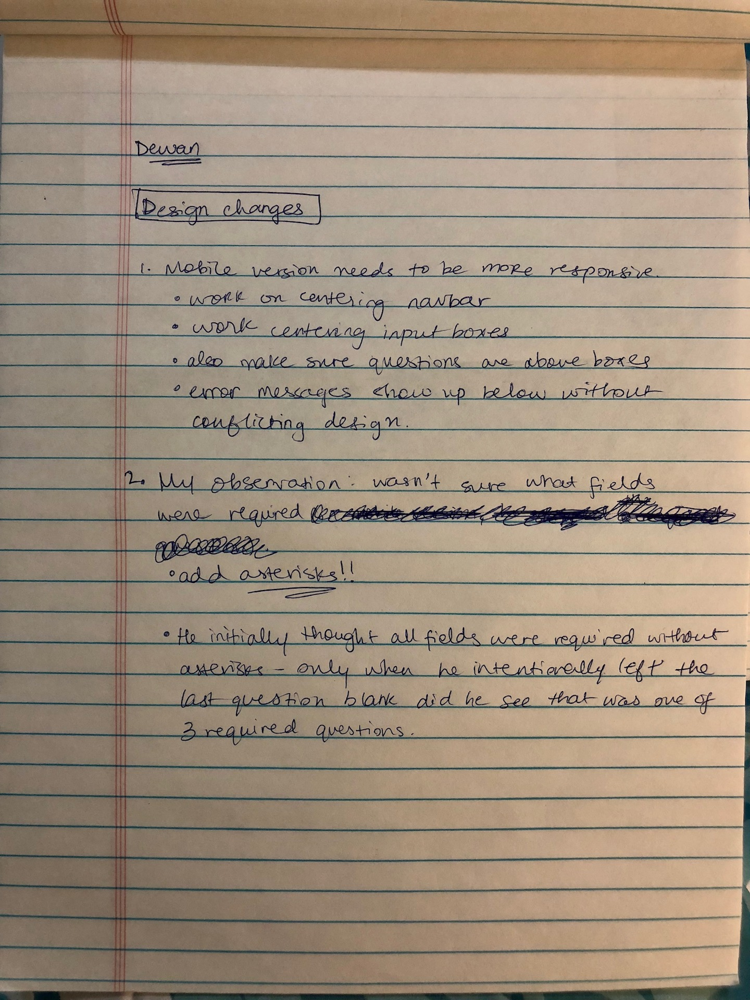

# Project 3 - Design Journey

**For each milestone, complete only the sections that are labeled with that milestone.**

Be clear and concise in your writing. Bullets points are acceptable.

## Milestone 1

## Target Audience (Milestone 1)

[Who is your site's target audience? This should be the original target audience from Project 1 or Project 2.]

With this website, my target audience is anybody who is not a frequent visitor to
Cornell or has only visited once or twice. This targets new students, parents of freshman, transfer,
or international students who have not visited Cornell frequently, and audience that
lives in neighboring cities like Syracuse, Binghamton, and Buffalo. Both audiences,
based on the interviews I conducted, is unsure of what the festival offers and where
it is located.

## Planning & Designing User Input (Milestone 1)

[Determine what purpose the form for your site will accomplish, where it will go (physical placement on page and the HTML file name), and what form elements you plan on using.]

This form will go on the "Feedback" page of my website (feedback.html). Users can use this form to
submit their impressions of the Event, how useful the website is, and what the website can improve upon.
It will include feedback questions about the festival (if users attended), what information would have helped users most, and how useful the website was/is.

This form will certainly include basic form elements such as the form element to contain other elements. There will be input and textarea elements (for short answers like Name, email or longer questions or queries). It will also include select elements (checkboxes) so that the user can select the overall subject of their query beforehand. Knowing which subject area (directions, about the festival, vendors etc.) queries are concentrated in will also help us improve the website and make it more relevant to users. The form will also have button element for the submit button that submits the form.

[Include sketches on your form below. Include sketches of your mobile and desktop versions. Image must show in Atom's Markdown Preview, otherwise 0 points for sketch. (Remember your relative URL should be case sensitive.)]

<!-- Source: (original work) Nighat Ansari -->
Desktop Version of the Form:

<!-- Source: (original work) Nighat Ansari -->
Mobile Version of the Form:

[What submission method will your form use? GET or POST. Explain your reasoning.]

Since my form is dealing with sensitive information about users (names, emails, preferences, habits etc.), using POST makes more sense so that information is not saved in browser history and is not as susceptible to hackers.

## Determine the Form Validation Criteria (Milestone 1)

[For each control in your form, specify the validation criteria and your reasoning behind the criteria.]

1. Name: control: Name ( <input type="text"> ) required control constraints: not empty

Requests are associated with people, so a name is necessary and acts as a unique identifier to the request. However, just a first name is not enough due to common names, so if there was some way to check a name and last name was submitted, that would be ideal.

2. Email: control: Email ( <input type="email"> ) required control constraints: not empty, formatted as @/.com address

To respond to users' requests, their email ids are necessary. This way users can receive follow ups to their requests in a timely manner. The email field must not be blank and the email should be valid (have an @ and . format).

3. Status of Attendance: control: Status of Attendance ( <input type="select"> ) no control constraints necessary because the "yes" option on this dropdown is already pre-selected, so there is always an answer selected.

Knowing whether or not the user attended the event is important to learning about how effective the website is. This control asks users if they attended the event or not. This will help inform the questions that follow. I am not sure if HTML/Javascript has the option to customize a form as a user is inputting responses.

4. Feedback about Festival: control: Feedback about Festival ( <input type="textarea"> ) not required control constraints: none

This pertains to users who went to the festival. This question will ask what their overall impression of the festival was and what they were most excited about at the festival. This will help the website designer focus on more popular aspects of the Festival on the website.

5. Feedback about Website Usage: control: Website Usage ( <input type="select> ) no control constraints necessary because the "yes" option on this dropdown is already pre-selected, so there is always an answer selected.

This question asks whether or not a user referred to the website before the date of the event for information or details. If the user answers no, the website designer knows the website needs to be a more easily available or prevalent resource. The number of users responding yes will allow designers to gauge how much audience engage with the website.

6. Feedback about Website: control: Website content ( <input type="textarea"> ) required control constraints: not empty

Regardless of what their answer was to the previous part, users will comment on the website, how useful it is/might be, and what it can improve. This will allow designers to fix both the utility and design of the website.

## Design Form Feedback (Milestone 1)

[Include sketches of your mobile and desktop feedback.]

The feedback messages are highlighted in yellow.
<!-- Source: (original work) Nighat Ansari -->
Desktop Version of the Form:

<!-- Source: (original work) Nighat Ansari -->
Mobile Version of the Form:

##  Plan Validation Pseudocode (Milestone 1)

[Write your form validation pseudocode here.]

When the user clicks on the submit button:

  Maintain a variable to keep track of whether or not to submit.

  If the field Name is empty:
    Show a feedback message to "Please enter your Name."
    Do not submit the form (set the variable to False.)
  else,
    Hide the feedback message.
    Submit the form.

  If the field Email is empty:
    Show a feedback message to "Please enter an email."
    Do not submit the form (set the variable to False.)
  else,
    Hide the feedback message.
    Submit the form.

  If the field email does not have "@" or ".":
    Show a feedback message to "Please enter a valid email."
    Do not submit the form (set the variable to False.)
  else,
    Hide the feedback message.
    Submit the form.

  If the field Feedback about Website (general) is empty:
    Show a feedback message to "Please share your thoughts."
    Do not submit the form (set the variable to False.)
  else,
    Hide the feedback message.
    Submit the form.

return variable

## Additional Information (Milestone 1)

[(optional) Include any additional information, justifications, or comments we should be aware of.]

(NOTE: The Status of Attendance or Website Visited do not need not be validated
  based on user-selection because they are drop-down menus that default to "yes"
  if the user does not change them.

  The Festival Feedback field is not a required attribute.)

  ## Final Submission

  ### Task Planning (Final Submission)

  [Plan out your one task for the Final Submission here before doing your user testing.]

  I will keep the basic task the same for both my users, but I will slightly modify the task for my second user to test different aspects of my form.

  For User #1: Leave feedback on the website as a student who went to the festival and consulted the website before going. Be sure to fill out all the required fields.

  For User #2: Leave feedback on the website as a student who went to the festival and consulted the website before going. In the mobile version, also leave the last question blank.

  Screenshots of the website I user-tested on:

  <!-- Source: (original work) Nighat Ansari -->
  
  <!-- Source: (original work) Nighat Ansari -->
  

  ### Participant 1 (Final Submission)

  1. Who is your participant, e.g., what is their name, where do they comes from, what is their job, characteristics, etc.?

  My first participant is Gabriela Taslitsky, a friend from high school, who studies at Simmons College. This past weekend, she met up with me in NYC and she will be driving up to visit Ithaca sometime next year. She has never been to the Harvest Festival or Ithaca, but Apples are her favorite fruit and she loves food festivals!

  2. Does your participant belong to your target audience of the site? (Yes / No)

  Yes, she does because she is not local to Ithaca and visits Ithaca. Since she is not outdoorsy and she enjoys food events, this Festival is likely an event she would go to.

  [If “No”, what’s your strategy of associating the user test results to your target audience’s needs and wants? How can your re-design choices based on the user tests make a better fit for the target audience?]

  ### User Testing for Participant 1 (Final Submission)
  [Report the results for your user's performance on each of your tasks. You should **describe the task** you ask the user to complete, explain **what the user did**, describe the user's **reaction/feedback** to the design, **reflect on the user's performance**, determine what **re-design choices** you will make. You can also add any additional comments in the **memo** field.]

  Format:
  - Task #1
  - **Task Description** (What was the task for this user?)
  - Leave feedback on the website as a student who went to the festival and consulted the website before going. Be sure to fill out all the required fields.

  - **How did the user do? Did that meet your expectation?**
  - The user correctly navigated to the "Feedback" tab using the navigation bar.
  - **User’s reaction / feedback to the design** (e.g., specific problems or issues found in the tasks)

  - **IMPORTANT NOTE** I just realized that the form Gabby submitted was not actually submitted because my Javascript wasn't correctly submitting at that point. I think that is why she wasn't sure if she had submitted the form. I did not have the "on.("submit")" portion of the code written in correctly. Her form was likely not submitted, but she shared her responses with me and I documented them in my notes below.
  - User thought the feedback tab was easy to find.
  - She completed the form, but when she submitted, she wasn't sure if the submission was completed.
  - She also commented it would be helpful to know what is required when the user is filling the form
  out (with an asterisk maybe) before needing to fill out every part of the form.
  - She also felt it would be worth mentioning what the purpose of the feedback is and what it would be
  used for.
  - **Your reflections about the user’s performance to the task**
  - She completed the task as expected.
  - **Re-design choices**
  - I will mark required questions with an asterisk.
  - **Memo** (Justify your decisions; additional notes.)
  - I did mark my required questions with asterisks in my sketches, but could not figure out exactly how to make their color different in code. I will work on it tonight.
  - I also think adding just a brief purpose of collecting feedback might be useful.

  [Include evidence that you conducted user testing.]

  Text confirming she tested the website:
  <!-- Source: (original work) Nighat Ansari -->
  

  Here are my notes on the user-testing I conducted with Gabby:
  <!-- Source: (original work) Nighat Ansari -->
  
  <!-- Source: (original work) Nighat Ansari -->
  

  ### Participant 2 (Final Submission)

  1. Who is your participant, e.g., what is their name, where do they comes from, what is their job, characteristics, etc.?

  Dewan is a student who went to the Harvest Festival this year. He really enjoyed the glazed cider donuts and mac 'n' cheese at the festival, but was overwhelmed by everything the Festival had. He wishes he spent more time near the vendor sections. He is originally from New York and is always heading back to the City on free weekends, but knowing more about festivals like this make Ithaca more exciting to him.

  2. Does your participant belong to your target audience of the site? (Yes / No)

  Yes, he belongs to my target audience because he is a student who would have benefitted greatly from my website's specific information about the Festival.

  [If “No”, what’s your strategy of associating the user test results to your target audience’s needs and wants? How can your re-design choices based on the user tests make a better fit for the target audience?]

  ### User Testing for Participant 2 (Final Submission)
  [Report the results for your user's performance on each of your tasks. You should **describe the task** you ask the user to complete, explain **what the user did**, describe the user's **reaction/feedback** to the design, **reflect on the user's performance**, determine what **re-design choices** you will make. You can also add any additional comments in the **memo** field.]

  Format:
  - Task #1
  - **Task Description** (What was the task for this user?)
  - Leave feedback on this website as a student who went to the festival but did NOT consult the website before going. In the mobile version, also leave the last question blank.
  - **How did the user do? Did that meet your expectation?**
  - The user correctly navigated to the "Feedback" tab using the navigation bar.
  - Met my expectations
  - **User’s reaction / feedback to the design** (e.g., specific problems or issues found in the tasks)
  - User said the form was easy to understand and relevant to the content of the website.
  - Felt the mobile version wasn't as aligned as it should have been and it could have been more mobile-friendly.
  - In the mobile version, he left the last field blank,
  received an error which wasn't aligned (distorted the
    alignment of the rest of the form.)

    - **Your reflections about the user’s performance to the task**
    - User also had some trouble with knowing what elements were required (based on my observation).
    - My mobile design wasn't fully responsive so some elements were not as aligned as they should have been. I will make my design more mobile responsive.
    - **Re-design choices**
    - Make sure feedback on the mobile version doesn't interfere with the questions.
    - Work on centering nav bar, centering the boxes for responses and making the design more
    mobile-friendly.
    - **Memo** (Justify your decisions; additional notes.)

    [Include evidence that you conducted user testing.]
    <!-- Source: (original work) Nighat Ansari -->
    A picture of Dewan while he completed the task.
    

    My notes during user-testing and his submission.
    <!-- Source: (original work) Nighat Ansari -->
    
    <!-- Source: (original work) Nighat Ansari -->
    

    ### Additional Users...

    [If you conduct more user tests of your website, include your tests here. You are not *required* to conduct these additional tests, but you might find them helpful for refining your website.]

    ### Additional Design Justifications (Final Submission)

    [If you feel like you haven’t fully explained your design choices in the final submission, or you want to explain some functions in your site (e.g., if you feel like you make a special design choice which might not meet the final requirement), you can use the additional design justifications to justify your design choices. Remember, this is place for you to justify your design choices which you haven’t covered in the design journey. Use it wisely. However, you don’t need to fill out this section if you think all design choices have been well explained in the final submission design journey.]
